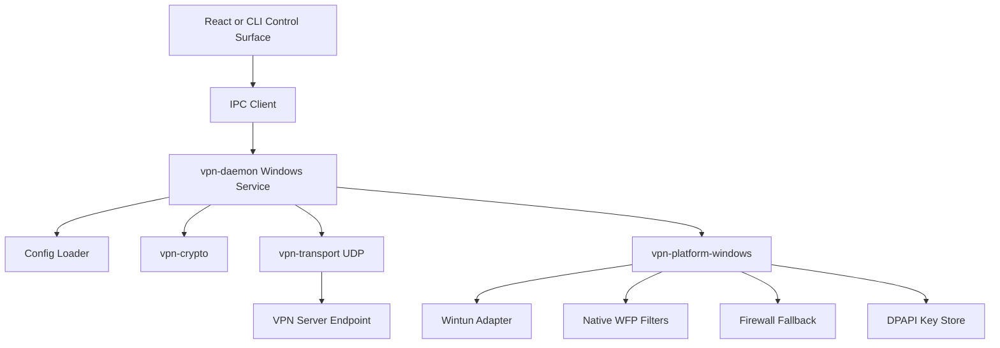
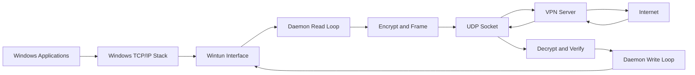
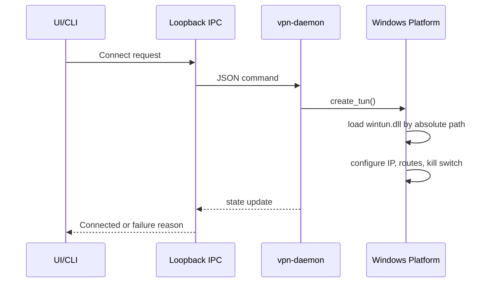
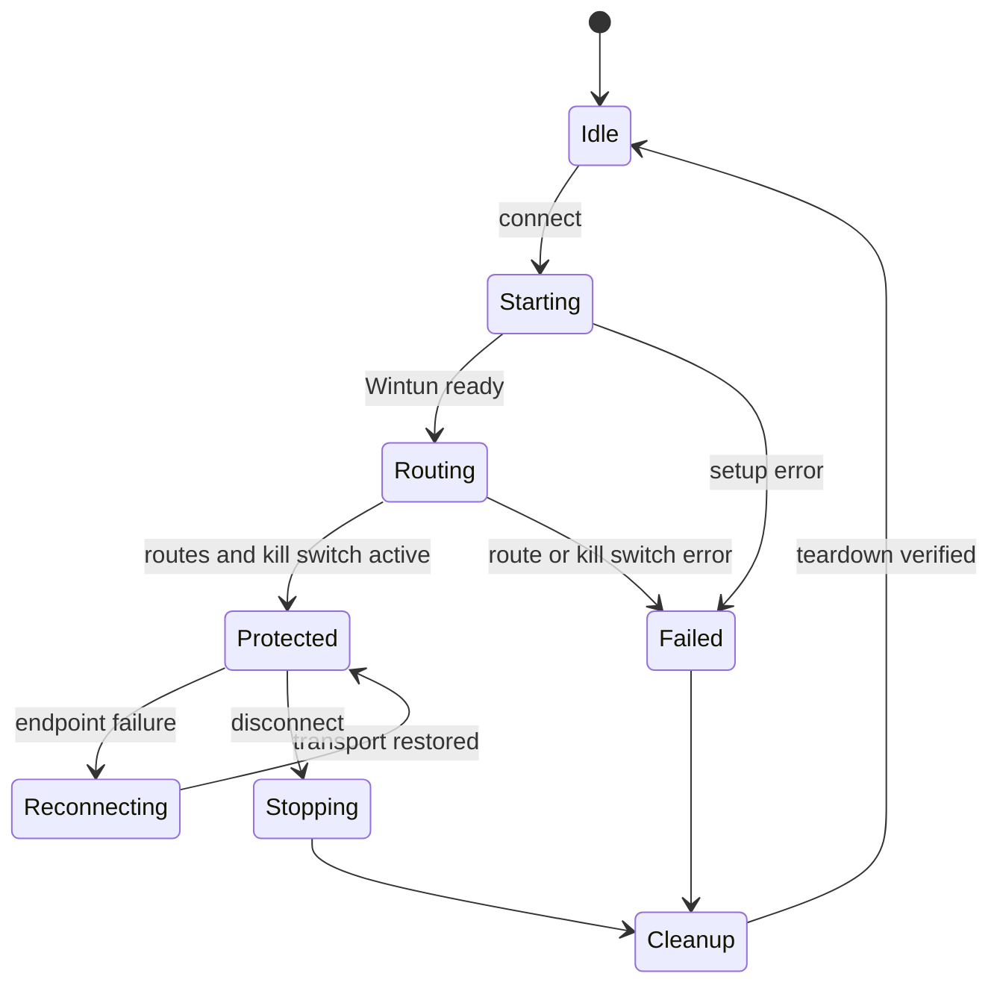
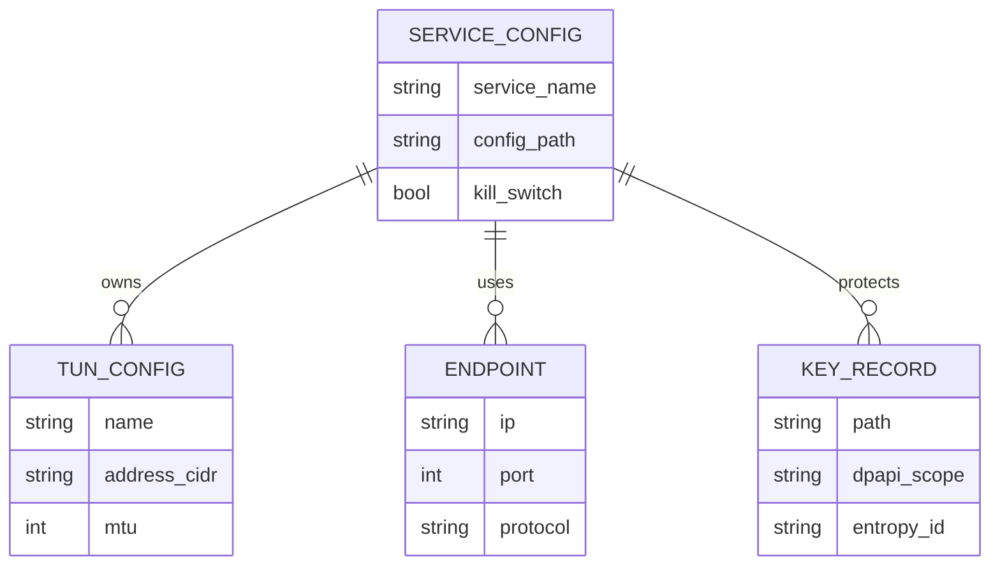
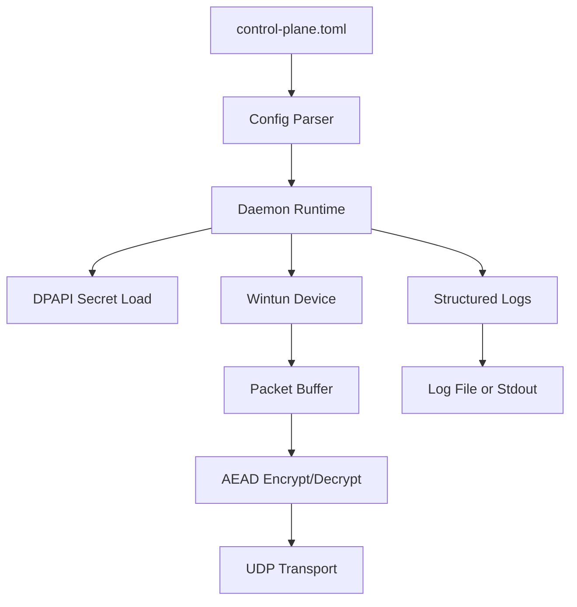

# Aegis VPN - Windows Architecture and Operations

## 1. Project Overview

Aegis VPN is a Rust-based Windows VPN client architecture that runs a privileged daemon, creates a Wintun tunnel adapter, routes selected traffic through an encrypted UDP transport, and enforces a Windows kill switch through native Windows Filtering Platform (WFP) filters with a Windows Firewall fallback.

Designed by Santhosh. Reviewed by Sandy. Version v0.2.0. Target v1.0.0. License Apache-2.0.

### Windows Support Matrix

| Component | Windows 10 22H2 | Windows 11 23H2/24H2 | Windows Server 2022/2025 | Notes |
|---|---:|---:|---:|---|
| Wintun adapter | Supported | Supported | Supported | Requires administrator rights and `wintun.dll` beside the daemon or an absolute DLL path. |
| Native WFP kill switch | Experimental | Experimental | Experimental | Requires administrator rights and `AEGIS_ENABLE_NATIVE_WFP=1`. Runtime packet validation is still a release gate. |
| Firewall fallback | Supported | Supported | Supported | Backs up profile outbound defaults under `HKLM:\Software\AegisVPN\Firewall`. |
| Windows service host | Supported | Supported | Supported | Installed as an own-process service with delayed auto-start and restricted service SID. |
| DPAPI key storage | Supported | Supported | Supported | Uses machine/user DPAPI through `CryptProtectData` and additional entropy. |
| PowerShell automation | PowerShell 5.1+ | PowerShell 5.1+/7 | PowerShell 5.1+/7 | Install and cleanup scripts require elevation. |

## 2. Architecture

### System Architecture



### VPN Packet Pipeline



### UI->Backend Flow



### State Machine



### ERD



### Data Flow



## 3. Platform-Specific Sections

### Wintun

The Windows platform crate loads `wintun.dll` from an explicit absolute path. By default the DLL must be colocated with `vpn-daemon.exe`; relative DLL paths are rejected to prevent DLL search-order hijacking. Adapter creation requires administrator rights, creates or opens the configured adapter name, starts a 4 MiB Wintun session, and exposes it as a `vpn_tun::TunDevice`.

### WFP

Native WFP filters are installed through `windows-sys` bindings on `FWPM_LAYER_ALE_AUTH_CONNECT_V4` and `FWPM_LAYER_ALE_AUTH_CONNECT_V6`. The current v0.2.0 implementation permits the VPN endpoint and loopback, then blocks other outbound connect attempts. Because interface-scoped WFP permit behavior still needs elevated packet validation, native WFP is opt-in through `AEGIS_ENABLE_NATIVE_WFP=1`; the default kill switch path uses the firewall fallback. Filters are installed transactionally and tracked by ID for teardown. Orphan recovery enumerates filters whose display name starts with `Aegis VPN`.

### Firewall Fallback

When native WFP installation fails after elevation is confirmed, the daemon applies Windows Firewall rules in the `AegisVPN` group. Before changing profile outbound defaults, it stores the current profile actions in `HKLM:\Software\AegisVPN\Firewall\ProfileDefaultsJson`; uninstall and kill-switch cleanup restore those exact values.

### Service Host

The Windows service host starts through the SCM dispatcher, reports `StartPending`, then `Running`, reports `StopPending` when SCM sends Stop, and reports `Stopped` with a non-zero Win32 exit code if the daemon fails. Stop control sends an IPC disconnect and waits up to 30 seconds before aborting the daemon task.

### Route Management

Route setup pins the VPN server endpoint through the current physical default route and installs default routes through the Wintun interface. IPv4 uses `/32`; IPv6 uses `/128`. Teardown removes routes by `InterfaceAlias` and validates that no routes or firewall rules remain.

### Key Storage

Windows key material is protected with DPAPI using `CryptProtectData`, `CryptUnprotectData`, `CRYPTPROTECT_UI_FORBIDDEN`, and Aegis-specific entropy. Files are written after encryption and zeroized in memory where DPAPI returns temporary buffers.

### Known Limitations

Runtime WFP packet behavior still needs validation on an elevated Windows host with Wintun installed before native WFP can be enabled by default. The project does not yet include an MSI/MSIX installer, driver provenance check, EV signing, or a Windows HLK-style network regression suite.

## 4. Features

| Area | Implemented in v0.2.0 | Planned |
|---|---|---|
| Wintun | Absolute DLL loading, adapter open/create, read/write packet path | DLL signature verification and packaged installer |
| Kill switch | Firewall fallback by default; native WFP available by explicit opt-in | Interface-scoped WFP permit rules validated by packet tests and enabled by default |
| Service | SCM install/uninstall, delayed auto-start, restricted SID, recovery actions, StartPending/StopPending/Stopped status | Service health event log integration |
| Routes | IPv4/IPv6 server pinning and TUN default routes | Multi-endpoint failover routes |
| Secrets | DPAPI protect/load helpers | Secret rotation and machine-scope policy selection |
| Automation | Hardened install/uninstall PowerShell scripts | Signed scripts and installer bootstrapper |
| CI | Windows check, clippy, tests, PowerShell analyzer, dependency audit | Elevated Windows integration lane |

## 5. File/Folder Structure

| Path | Windows Role |
|---|---|
| `crates/vpn-platform-windows/src/lib.rs` | Wintun, routes, firewall fallback, DPAPI, teardown checks |
| `crates/vpn-platform-windows/src/wfp_native.rs` | Native WFP engine/session/filter management |
| `crates/vpn-platform-windows/src/service_installer.rs` | SCM service creation, deletion, validation, recovery settings |
| `crates/vpn-platform-windows/src/admin.rs` | Administrator/elevated-token checks |
| `crates/vpn-platform-windows/Cargo.toml` | Windows API feature declarations |
| `crates/vpn-daemon/src/service_host.rs` | Windows service entrypoint and stop lifecycle |
| `scripts/windows/install-service.ps1` | Elevated service installation and ACL hardening |
| `scripts/windows/uninstall-service.ps1` | Service, firewall, process, and install-root cleanup |
| `scripts/windows/validate-wfp.ps1` | Manual WFP/firewall validation helper |
| `.github/workflows/ci.yml` | Windows CI, PowerShell static analysis, dependency audit |

## 6. Data Pipelines

### Crypto Pipeline

Packet bytes move from Wintun into the daemon packet loop, are framed and encrypted by the crypto layer, sent over UDP, then decrypted and written back to Wintun. DPAPI protects local Windows key material at rest.

### Logging Pipeline

Service and platform actions emit structured `tracing` records. PowerShell setup scripts rely on terminating errors and verbose output. Production logging should route daemon events to a file or Windows Event Log before v1.0.0.

### Config Pipeline

`control-plane.toml` is copied into `%ProgramFiles%\AegisVPN\config\control-plane.toml` during service installation. The installer restricts ACLs to SYSTEM and Administrators, then passes the absolute config path to the daemon service command.

## 7. Bug Tracking

| ID | Status | Severity | Module | Issue | Fix | Owner |
|---|---|---|---|---|---|---|
| WIN-CRIT-001 | Completed | Critical | Wintun/API | Windows `create_tun` did not satisfy daemon `TunDevice` contract | Returned `WindowsTun` and implemented `TunDevice` | Principal Windows Systems Architect |
| WIN-CRIT-002 | Completed | Critical | WFP | Manual WFP FFI used invalid layouts and constants | Replaced with `windows-sys` WFP APIs | Senior Kernel Engineer |
| WIN-HIGH-001 | Completed | High | Firewall | Cleanup reset all profiles to Allow | Back up and restore exact profile defaults | Security Auditor |
| WIN-HIGH-002 | Completed | High | Routes | PowerShell used invalid NetAdapter/IP parameters | Switched to `-Name`, `-InterfaceAlias`, and validation | PowerShell Automation Expert |
| WIN-HIGH-003 | Completed | High | SCM | Service path and `sc.exe` handling were unsafe/fragile | Canonical paths, quoted `binPath`, System32 `sc.exe` | SCM Specialist |
| WIN-HIGH-004 | Completed | High | Installer | Service install used mutable source paths and relative config | Copy into Program Files and lock ACLs | IAM Engineer |
| WIN-MED-001 | Completed | Medium | Routes | IPv6 and duplicate endpoint routes were mishandled | IPv4 `/32`, IPv6 `/128`, duplicate cleanup | Network/SRE |
| WIN-MED-002 | Completed | Medium | Service | Stop could hang or hide daemon failure | Timeout stop path and propagate exit code | SRE |
| WIN-MED-003 | Completed | Medium | CI | Windows checks and PowerShell analyzer were incomplete | Added Windows lint/check/test/audit gates | QA Automation Lead |
| WIN-LOW-001 | Completed | Low | Admin | Non-Windows test stub depended on undeclared `libc` | Removed `libc` dependency from stub | Repository Forensics Auditor |
| WIN-GATE-001 | Fix Required | High | WFP | Elevated packet behavior not proven on a live host | Keep native WFP opt-in until elevated integration tests and packet capture validation pass | QA Automation Lead |
| WIN-MED-004 | Completed | Medium | Service | Stop control did not report `StopPending` | Shared the service status handle with the control handler | SCM Specialist |
| WIN-CLEAN-001 | Remove | Low | Repository | Stale `lib.rs.backup` shadows old unsafe Windows code | Delete from repo/worktree | Repository Forensics Auditor |

## 8. Setup & Run

### Prerequisites

Install Visual Studio Build Tools with the MSVC toolchain and Windows SDK, Rust stable, PowerShell 5.1+, administrator rights, and a trusted Wintun release DLL colocated with `vpn-daemon.exe`.

```powershell
rustup toolchain install stable
rustup component add rustfmt clippy
cargo install cargo-audit --locked
```

### PowerShell Setup

```powershell
powershell.exe -ExecutionPolicy Bypass -File .\scripts\windows\install-service.ps1 `
  -DaemonPath .\target\release\vpn-daemon.exe `
  -ConfigPath .\config\control-plane.toml `
  -ServiceName AegisVpn `
  -DisplayName "Aegis VPN"
```

### Service Lifecycle

```powershell
sc.exe query AegisVpn
Start-Service AegisVpn
Stop-Service AegisVpn
powershell.exe -ExecutionPolicy Bypass -File .\scripts\windows\uninstall-service.ps1 -ServiceName AegisVpn -RemoveInstallRoot
```

### Debugging

```powershell
Get-Service AegisVpn
Get-NetAdapter -Name aegis0 -ErrorAction SilentlyContinue
Get-NetRoute -InterfaceAlias aegis0 -ErrorAction SilentlyContinue
Get-NetFirewallRule -Group AegisVPN -ErrorAction SilentlyContinue
Get-ItemProperty HKLM:\Software\AegisVPN\Firewall -ErrorAction SilentlyContinue
```

### Recovery/Troubleshooting

```powershell
Stop-Service AegisVpn -Force -ErrorAction SilentlyContinue
Get-Process vpn-daemon -ErrorAction SilentlyContinue | Stop-Process -Force
Get-NetFirewallRule -Group AegisVPN -ErrorAction SilentlyContinue | Remove-NetFirewallRule
$backup = Get-ItemProperty HKLM:\Software\AegisVPN\Firewall -Name ProfileDefaultsJson -ErrorAction SilentlyContinue
if ($backup) {
  $backup.ProfileDefaultsJson | ConvertFrom-Json | ForEach-Object {
    Set-NetFirewallProfile -Profile $_.Name -DefaultOutboundAction $_.DefaultOutboundAction
  }
}
Remove-ItemProperty HKLM:\Software\AegisVPN\Firewall -Name ProfileDefaultsJson -ErrorAction SilentlyContinue
```
